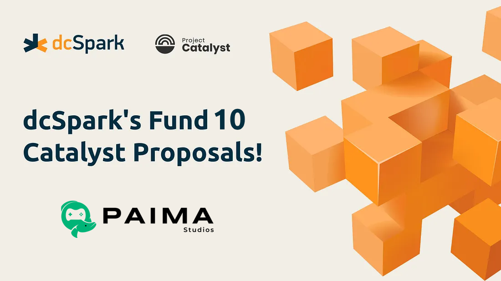
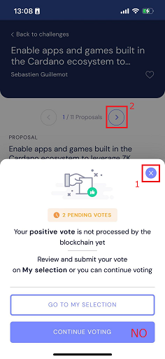

いよいよCatalystのファンド10が始まりました。dcSparkは、Cardanoの次世代のdAppsの根本を支えるインフラ構築のための提案をファンド10で提出しています。

dcSparkは、Catalyst提案の完遂能力が最も高い企業の一つです。
なぜならば、Catalystのすべての提案のうちdcSparkの提案はわずか約1%ですが、
Catalystのすべての完了した提案のうち約5～10% はdcSparkの提案だからです。

（単にアプリを作る、というだけではなく）エコシステム（経済圏）を構築するというミッションを果たすために、コアなインフラ、サイドチェーン、オープンソーススマートコントラクト、ユーザー向け製品など、多岐にわたる開発をしてきました。
今回のFUND10では、<b>[自律的な世界（Autonomous World - AW)](https://www.youtube.com/watch?v=qlaXTJObDJk)</b>、オンチェーンゲーム、ゲーミフィケーションに全力を注ぐ所存です。

<!-- truncate -->

なぜかというと、日本発である[Paima Engine](https://twitter.com/paimastudios)により、ブロックチェーンの中で最も競争力のあるプラットフォームを構築し、急成長する自律世界であるWeb3領域で、世界のリーダーになれると確信しているからです。

ところで、Paimaについて詳しく調べると、（例えば、[Youtubeで説明されてるように](https://www.youtube.com/watch?v=HtvemijxF-0)）、PaimaはCardanoエコシステムのみならず、異なるチェーンにでも使用されることが可能だと気付くでしょう。Paimaはクロースチェーンソリューションですが、私達の成長をずっと応援してきた複数のチェーンの中でも、とりわけCardanoチェーンのコミュニティの成長につながる仕組みを考えました。

Paima とCardanoと、Win-Winの関係を築く仕組みの説明のため、まずPaimaのビジネスモデルを説明します。
Paimaは、ゲームエンジンと似たモデルで、基本無料ですが、営利目的の使用で一定の収益を超えるとロイヤリティを支払う必要があります。ロイヤリティは将来的に、PaimaをDAO化したときDAOの維持費用となります。
ここで、Paimaを利用したアプリをCardanoのエコシステム上でデプロイしたとき、ロイヤリティの割引を考えています。
一例ですが、Paimaを利用したアプリをデプロイする際に一定の収益を超えると 、Ethereumエコシステムでは7%のロイヤルティ支払いですが、Cardanoエコシステムでデプロイすると3.5%しか支払わなくても大丈夫、といった形です（あくまで一例です）。
正確には、Cardanoでデプロイされるプロジェクトのロイヤリティ支払いを最大50％削減します。具体的には、私たちのFUND10の提案が全て採用されるとロイヤリティ50%割引、半分採用されるとロイヤリティ25%割引とします。

この仕組みにより、Paima とCardano の2つのエコシステムがより強く結びつくと確信しています。自社アプリをどのチェーン上に開発するか悩むプロジェクトがCardanoを選べば、ロイヤルティ割引が受けられるのみならず、自社アプリのNFTをERC721より安全なCNFTとして発行することもでき、分散性の高いCardanoにアプリの安全性守られます。すなわち、CardanoがPaimaに最適なエコシステムとしてアピールできるのです。

自律的世界-Web3.0とPaimaの潜在能力に関して、ワクワクしてきましたか？あなたと一緒に堅牢なエコシステムを構築するのを楽しみにしています

### 提案のランキング

もちろんすべての提案をサポートしていただいた方々には非常に感謝していますが、提案の一部だけをサポートしたい場合、簡単に優先順位を把握できるように、提案を4つのカテゴリーに分けました：

1. **コアー**: Paimaの根本的なインフラに必要な提案
2. **拡張**: Paimaのオンボーディングに貢献する提案
3. **補足**: Paimaの成長に貢献しますが、積極的にこの提案のプロモーションをする予定がありません
4. **協力会社**: dcSparkではなく協力会社関連の提案（以上のPaimaの割引と関係ないです）

# 速く投票できる方法

Catalystアプリで提案を検索したのちにこのように投票していくと、複数の提案に対して、非常に効率的に投票できました！（2分ぐらいで全部投票し切れる）

1. 「Sebastien Guillemot」を検索して、すべての提案に投票をする（これでほぼ全案に投票できる）

CONTINUE VOTINGを押さないことがポイントです。。。
（これを押してしまうと、やや長めのロードがいちいち入るので下手すると多分全部やるのに20分ぐらいかかるかも。。。）

2. 「Stateful NFT」を検索して投票をする
3. 「Open Source POAP」を検索して一番上の提案に投票をする
4. 「Largest Blockchain EXPO」を検索して投票をする
5. 「Thiago Nunes」を検索して「NFC」をタイトルに入れている提案に投票をする

ご参考になりましたら幸いです🙇

# コアー

Proposals that we believe are core to the success of Paima

### 分散型AI対応＋SNS/Apple FaceIDログイン
英語名：Core integrations to support the fast-growing onchain games and autonomous world segment 
Cost: ~130K USD

  
Proposal summary

  

This proposal is the combination of thee separate tasks

- Shinkai Visor AI LLM to allow onchain games to leverage decentralized AI components - 40k [link](https://docs.google.com/document/d/1F8q_7m3MEvuSwCICTc81HGmB-tgeEROrfIJUqBG6GIg/edit)
- Virtual Wallets so users don't need a crypto wallet installed to play, and potentially just play with something like Apple FaceID - 60k [link](https://docs.google.com/document/d/15TqBvMJl9TqIA2MEjYvG2KLkOx5Sbviqn_tPAfyVQ3s/edit)
- Social login for Paima (Google login, Microsoft account, etc.) - 30k [link](https://docs.google.com/document/d/1R1JIkrNksR-T-ETbGXkLpQhdsdKcmTA7YxQ345BNynI/edit#heading=h.pv6x4u8av1dp)

  

Ideascale: [link](https://cardano.ideascale.com/c/idea/107591) 
Lidonation: [link](https://www.lidonation.com/proposals/core-integrations-to-support-the-fast-growing-onchain-games-and-autonomous-world-segment-f10)

### 他のチェーンからCardano上のNFTにアクセス可能にするツール
英語名：Allow using NFTs from Cardano and other ecosystem in onchain games hosted in the Cardano ecosystem 
Cost: ~145K USD

  
Proposal summary

  

This proposal is composed of 3 different components to be able to reference 3 different kinds of NFTs from Paima:

Paima Projection NFTs - 145k
- Paima Projection NFT Whirlpool continued work for Cardano 75k [link](https://docs.google.com/document/d/1nEz9fe8UqkSvFJ-nSYwuvOrrcnPIO853znUK2VCDvxE/edit)
- Paima Projection NFT Whirlpool for EVM 40k [link](https://docs.google.com/document/d/1cv95BmdpgMbh43MR1ewH_YM5utc4uh1y773dT73ezro/edit)
- Paima Projection NFT Whirlpool for Polkadot WASM NFTs 30k [link](https://docs.google.com/document/d/1m4iJM9PNMuewPJUeixRK8BrWmMGnXhb18VYiIyAoH7U/edit)

 
Each proposal increases the viability of Paima by allowing games deployed to the Cardano ecosystem to leverage the liquidity of an increasing number of NFT ecosystems, as well as allow Cardano NFTs to be used in games hosted in other ecosystems

  
You can see the individual proposals for more details, but generally if you want to learn about the architecture for this system at a deeper technical level, we’ve written an Aiken smart contract for Cardano which has extensive documentation that you can find [here](https://github.com/dcSpark/projected-nft-whirlpool/)

  

Ideascale: [link](https://cardano.ideascale.com/c/idea/107656) 
Lidonation: [link](https://www.lidonation.com/proposals/allow-using-nfts-from-cardano-and-other-ecosystem-in-onchain-games-hosted-in-the-cardano-ecosystem-f10)

### ウォレット安全自動署名システムでゲーム等を簡単に
英語名：Enable use-cases that require frequent message signing by introducing a safe standard for message signing without wallet prompts 
Cost: ~40K USD

  
Proposal summary

  

There has been a lot of growth in use-cases that require frequent message signing in the crypto ecosystem - primarily driven by NFTs and gaming. However, a lot of users lose interest when they realize how tedious it will be to accept the prompt by their wallet every time they have to sign a message  

As the authors of original Cardano message signing spec (CIP8: https://cips.cardano.org/cips/cip8/), we are very familiar with the cryptography involved in message signing. We are planning to release a layer on top of this message signing system to more easily allow wallets to auto-sign messages in cases where it knows it is safe to do so. Although we will create a more formal specification, you can find the initial approaches discussed in the following document: [link](https://docs.google.com/document/d/1VqXjyfgvbXxYHqhzYcSFFEorYbnza6GbjyAbVXyAKAM/edit?usp=sharing)  

Notably, a lot of the power of this proposal will rely on Paima Engine - a framework for creating web3 games, as it supports playing games using only standard message signing (no real transaction required). That means that if we have a safe and smooth flow for message signing, we can unlock a significantly better gaming experience.  

Notably, the project consisted of the steps:
1. Create a specification for this message signing system
2. Integrate it into at least one wallet

  

Ideascale: [link](https://cardano.ideascale.com/c/idea/107668) 
Lidonation: [link](https://www.lidonation.com/proposals/enable-use-cases-that-require-frequent-message-signing-by-introducing-a-safe-standard-for-message-signing-without-wallet-prompts-f10)

### Paimaと他の多くのゲームツールを統合
英語名：Paima onchain game integration of Frontend Game Engines & Novel Technology 
Cost: ~160K USD

  
Proposal summary

  

Currently there are integrations of Cardano wallets (through Paima) into multiple systems engines like:
- Unity
- Phaser
- Game Maker
- Javascript
- LLM AI models

Some of these integrations can be found [here](https://github.com/PaimaStudios/paima-game-templates)  

However, we plan to add integrations to the following systems as well:
- Unreal Engine
- GPS connections
- iOS and Android
- AR device if possible (like Vision Pro)  

Since new engines occasionally appear, we will monitor the space to other opportunities as well and reserve the right to change our mind about which engine/platform we prioritize spending funds on to maximize impact

  

Ideascale: [link](https://cardano.ideascale.com/c/idea/107684) 
Lidonation: [link](https://www.lidonation.com/proposals/paima-onchain-game-integration-of-frontend-game-engines-novel-technology-f10)

### データをどこに保管するか選択可能にするツール
英語名：Enable apps and games that require large amounts of data to function cheaply while still maximizing availability and safety 
Cost: ~60K USD

  
Proposal summary

  

Currently, many growing fields in the blockchain space sometimes require kilobytes of data per transaction to work. Notably, zk cryptography, L2s and web3 gaming  

Since these L2s and web3 gaming are both fairly high-frequency use-cases (transactions happen often), solutions like IPFS are not well equipped to store and pin all the different files. A common solution to this is to use a “Data Availability Layer†(DA Layer) such as Celestia or Avail that is optimized for these kinds of use-cases. However, using a DA Layer comes with a disadvantage because you have to trust the DA layer to function properly, and is generally more expensive and slower than posting the data directly to the underlying L1  

To tackle this problem in Paima, we propose allowing games and apps using Paima to use “Volitions”, which try to get the best of both worlds. They allow users to choose in which case they post their data directly on the L1, and in which case they post their data on the DA Layer. This allows clients to optimize for the best experience  

Notably, we plan to integrate Avail Project (https://www.availproject.org/) first as we believe they have the highest synergy with the Cardano ecosystem: they are based on Polkadot (whose underlying consensus is inspired by Ouroboros), and they have invested in a research-based approach working with new primitives like Coded Merkel Trees ([link](https://www.youtube.com/watch?v=thdxHtQgszk)) to make their technology competitive  

Notably, the plan for integration will have the following steps:
- Enable Paima to follow both the settlement layer and the DA light client at the same time
- Allow a way for clients to choose whether or not data gets posted to the settlement layer or the DA layer
- Allow merging L1 and DA layer data into a single stream for Paima apps to handle

  

Ideascale: [link](https://cardano.ideascale.com/c/idea/107691) 
Lidonation: [link](https://www.lidonation.com/proposals/enable-apps-and-games-that-require-large-amounts-of-data-to-function-cheaply-while-still-maximizing-availability-and-safety-f10)

### PaimaとZekoを利用してアプリやゲームでzk利用可能に
英語名：Enable apps and games built in the Cardano ecosystem to leverage ZK cryptography for privacy and scalability 
Cost: ~100K USD

  
Proposal summary

  

Currently many companies are looking into blockchain adoption for use-cases like commemorative NFTs point systems, DID, traceability and more. However, all of these require private data to avoid GDPR violations, which make them hard to manage with open systems like blockchains. Similarly, a lot of decentralized games are interested in similar concepts as they allow building games with information asymmetry like fog-of-war which is an important game mechanic. Additionally, the verifiability of ZK proofs also means that these could eventually be used to cheaply implement DeFi-focused components to games written with Paima (things that resemble casinos)  

Currently there is no good way to build these use-cases in the Cardano ecosystem, but fortunately Paima Engine (a framework for creating web3 apps and games) has a fairly clear path to adding these primitives. Notably, as a L2 solution, it has a lot more flexibility in adding new cryptographic primitives which are always hard to add directly to the Cardano L1  

Paima Engine allows writing onchain apps with Javascript, making them fairly easy to write for all developers. For the ZK circuit component, we’ve decided to partner with ZekoLabs. The reason is because they also allow writing ZK circuits in Javascript (so it feels like a unified experience for developers), and their system is based on Mina which is also compatible with Ouroboros and so it is a friendly project towards the Cardano community  

Notably, the plan for integration will have the following steps:
- Allow running ZK proofs locally and associating their results to Stateful NFTs. 
- Allow monitoring ZK appchains and merging their state into a Paima app

  

Ideascale: [link](https://cardano.ideascale.com/c/idea/107706) 
Lidonation: [link](https://www.lidonation.com/proposals/enable-apps-and-games-built-in-the-cardano-ecosystem-to-leverage-zk-cryptography-for-privacy-and-scalability-f10)

### NFT内の情報を変化させつつ売却も容易に可能なNFT開発
英語名：Support Stateful NFTs (dynamic NFTs) for gaming in NFT marketplaces 
Cost: ~100K USD

  
Proposal summary

  

Stateful NFTs can be really complex. For example, the image for your NFT could be the result of a complex aggregation of multiple events on chain and heavy computation. This means that building a NFT marketplace that renders all Stateful NFTs perfectly is a hard problem  

Instead, our goal will be to create a system so that games and apps can easily and cheaply setup app-specific NFT marketplaces that render their NFTs as desired. To avoid this having a negative impact on the liquidity of the NFT, we will build it in such a way that using this system means your NFT can still appear on other NFT marketplace (albeit maybe without being able to render the information in the NFT in as rich of a way)  

We also want to build a browser extension that helps render Stateful NFT information on existing marketplaces so that users can still get the full stateful information without having to resort to hunt down a lot of app-specific marketplaces

  

Ideascale: [link](https://cardano.ideascale.com/c/idea/103520) 
Lidonation: [link](https://www.lidonation.com/proposals/support-stateful-nfts-dynamic-nfts-for-gaming-in-nft-marketplaces-f10)

---
# 拡張

Proposals that makes it easier to onboard people and companies to Paima

### NFT内の情報をイベントにより変化可能NFT
英語名：Open Source POAP in Cardano 
Cost: ~80K USD

  
Proposal summary

  

Proof of Attendance Protocol (POAP) is a protocol that uses blockchain technology to create badges or collectibles to mark the attendance at an event. It is proven to be of great adoption in the majority of the EVM compatible blockchains, with more than 6.5M POAPs already minted. Believe it or not, this is only 2M less than the ENTIRE NFT ecosystem in Cardano!  

More concretely, users would receive a single Stateful Proof of Attendance NFT (SPOAP NFT) that starts out blank, and every time they participate in an event, they would get a new commemorative NFT embedded inside their SPoA. If they've ever received a single SPoA in their entire lifetime, event organizers will not have to mint them a new one which means the more users participate in the protocol, the cheaper it will get to distribute NFTs.  

Additionally, to enable building soulbound NFTs, these NFTs will be minted on Milkomeda (Cardano sidechain). This has the added benefit that transaction fees are also significantly cheaper than the Cardano L1, allowing for much larger and more regular drops and also bypasses the min UTxO issue. Thanks to the Milkomeda's work on wrapped smart contracts, it's still possible for Cardano users to fully control their SPoA directly from any Cardano wallet (Nami/Eternl/Flint/etc) and will not require any new wallets to be installed for neither event organizers nor regular participants

  

Ideascale: [link](https://cardano.ideascale.com/c/idea/100932/) 
Lidonation: [link](https://www.lidonation.com/proposals/open-source-poap-in-cardano-f10)

### NFTに報酬額を記録+後ほどその額をドロップ可能のシステム
英語名：Extend NFT sale & drop tools to support dropping more complex assets as required for onchain games 
Cost: ~115K USD

  
Proposal summary

  

If we look at funding platforms like Kickstarter, there are often multiple tiers to each preorder with (often overlapping) rewards. Trying to handle all this complexity at the NFT sale tool level is not only extremely complicated, it often introduces regulatory issues as most NFT sale platforms do not support purchasing fungible tokens for regulatory reasons.  

To solve this, we will leverage Stateful NFTs created by Paima Engine. Notably, Stateful NFTs are NFTs that can evolve overtime based on user actions. We will use this to allow purchasing into preorders to receive a Stateful NFT which can later be redeemed in-game once the game is launched. This allows very flexible pre-order systems as the redemption logic and tokens do not have to be created at the time of sale (similar to Kickstarter)  

Notably, the user flow will look at follows:
- User finds a game doing a pre-order on an NFT platform that they want to participate in
- They pay with ADA (or any other tokens the site supports) to buy into the pre-order, which uses Milkomeda wrapped smart contracts to credit them a Stateful NFT
- (optional) if they choose to add more money into the pre-order, their existing Stateful NFT will be updated
- Once the sale is over, use their Stateful NFT to claim their in-game reward once the game is release

We may work with Plutus Art for the first implementation, but we reserve the right to change partners depending on factors such as their availability

  

Ideascale: [link](https://cardano.ideascale.com/c/idea/107533) 
Lidonation: [link](https://www.lidonation.com/proposals/extend-nft-sale-drop-tools-to-support-dropping-more-complex-assets-as-required-for-onchain-games-f10)

### ゲーム実績の標準を作成、それを扱うプラットフォームを作成
英語名：Open standard for cross-game achievement system to gamify onchain participation 
Cost: ~75K USD

  
Proposal summary

  

The goal of an open standard for cross-game achievements should be that any website or app can choose to support the achievement system without having to rely on any central server, as opposed to existing achievement systems that are depend on a central party like XBox Live or PlayStation  

To create an open cross-chain achievement standard we have a few requirements:
- Achievements for a game can have in-game effects (ex: a game can unlock an in-game area if you have 5+ achievements unlocked). However, achievements in one game need not be accessible from another
- Services need to be able to efficiently read all achievements for a user’s account across games without having to rely on a centralized server
- Companies can self-specify achievements for their game without having to register with a central server

 
The main implementer of this system will be Paima Engine - a framework for creating onchain games and autonomous worlds.  

Notably, it will work by:
- Defining a standard interface for client indexers written for Paima that games need to implement
- The achievement website will scan all games written with Paima using the RPC standard to find the static data about which achievements are available in the game and which stateful NFTs are used for the game
- The achievement website will scan the user’s wallet for all addresses they own, and check if they own any NFT related to any Paima games. If so, it will query the games through the RPC standard to find which achievements they’ve unlocked and display them

 
To bring this to life, we will implement this standard, create an example achievement website that leverages it, and implement it into 3 games (Jungle Wars, Wrath of the Jungle, Tarochi)

  

Ideascale: [link](https://cardano.ideascale.com/c/idea/107558) 
Lidonation: [link](https://www.lidonation.com/proposals/open-standard-for-cross-game-achievement-system-to-gamify-onchain-participation-f10)

### サイドチェーンの機能をメインチェーンから直接実行できる
英語名：Allow Cardano users to call Sidechain smart contracts directly from their Cardano mainnet wallet 
Cost: ~100K USD

  
Proposal summary

  

Sidechains have always been part of Cardano’s scaling model, with some sidechains already existing like Milkomeda (EVM sidechain) and more planned. Additionally, L2s are increasing in popularity in other ecosystems and Cardano as well through Paima, which also help scale and add flexibility to the ecosystem.  

However, it’s hard to get adoption for new sidechains or L2s if users have to download a new specific wallet for every sidechain and L2 they interact with. Having wallet developers do native integrations also just does not scale (only 24hrs in a day and they probably have other Cardano features they want to focus on).  

To tackle this, we’ve developed a system called Wrapped Smart Contracts that allows users to call Milkomeda smart contracts directly from Cardano wallets (Nami, Eternl, Flint and more) without any extra work on behalf of the wallet developers.  

You can find more information at https://docs.milkomeda.com/category/wrapped-smart-contracts  

The project is (at time of writing) undergoing final integration by partner dApps before officially going live.  

Notably, the project consisted of the steps:
- Writing the specifications
- Integrating the system inside the EVM itself on Milkomeda (precompiles)
- Integrating the systems inside the Milkomeda bridge
- Coordinate a hardfork of Milkomeda to introduce these upgrades
- Having partners integrate Wrapped Smart Contracts into their dApps

  

Ideascale: [link](https://cardano.ideascale.com/c/idea/107634) 
Lidonation: [link](https://www.lidonation.com/proposals/allow-cardano-users-to-call-sidechain-smart-contracts-directly-from-their-cardano-mainnet-wallet-f10)

### Godotゲームエンジンとライトウォレット統合インフラ
英語名：MLabs – Cardano Game Engine Wallet - Godot Integration 
Cost: ~115K USD

  
Proposal summary

  

Godot is an engine, with the following benefits:

- It is open-source, which greatly simplifies the work needed to quickly get wallet support up and running
- Godot is quickly gaining significant adoption, particularly among indie developers (who, we believe, are the most likely to develop innovative blockchain integrations and experiment with new designs and revenue models)
- There are no licensing requirements or fees attached to its usage - which makes it attractive even to large game studios. (We note that Godot has recently been used by a major studio to develop a Sonic game, which demonstrates that it is suitable for both small-scale and large-scale development)
- Supports a robust system for extending the core engine (GDExtension), which promises to make the development of Cardano integration tools relatively painless.

 
We plan to provide an easy way to integrate Cardano wallets into games written with Godot, as well as Paima integration in general

  

Ideascale: [link](https://cardano.ideascale.com/c/idea/100468) 
Lidonation: [link](https://www.lidonation.com/proposals/mlabs-cardano-game-engine-wallet-godot-integration-f10)

### ゲームがプールや委任者を認識できるようにするツール
英語名：Powering onchain game functionality using Cardano stakepools 
Cost: ~200K USD

  
Proposal summary

  

Currently there is a high inherent financial incentive for high monitoring of DeFi-related applications and so there is a relatively easy path to decentralize the infrastructure related to dApp operation.  

For gaming, autonomous world and metaverse applications however, even if the infrastructure is made to be decentralizable, it’s hard to convince others to run the infrastructure as it is purely a selfless act for the greater good. To tackle this, we want to enable Cardano stake pools to be able to run infrastructure for onchain games and, through a connection to the Cardano L1, be able to know which player is delegating to their pool and support them by, for example, reducing or covering entirely the transaction fees for their in-game actions  

An interesting point of this proposal is that this infrastructure would not only allow Cardano stake pool to provide this kind of benefit to users playing games written with Paima in the Cardano ecosystem, but more generally would be able to provide these kinds of services for users across the crypto landscape, giving non-Cardano projects an easy path to leverage Cardano infrastructure to secure their game as well as introducing non-Cardano users to the Cardano ecosystem in case they want to purchase and delegate ADA to take advantage of benefits  

Notably, the plan for integration will have the following steps:
- Create an indexer using Scrolls or Carp to get pool information in the right format needed for Paima
- Provide better customizability of the Paima infrastructure (notably the batcher system) so that pools can easily modify its configuration to choose which benefits they want to provide without having to know how to code
- Integrate the indexer built in step (1) into the customization system from step (2) so that pools can lookup who is delegating to them to activate the benefits
- Add a way for stake pools to register themselves for games so that users know they can leverage their infrastructure either through a registry infrastructure or an on-chain registration

  

Ideascale: [link](https://cardano.ideascale.com/c/idea/107742) 
Lidonation: [link](https://www.lidonation.com/proposals/powering-onchain-game-functionality-using-cardano-stakepools-f10)

### ゲーム作成のための機能のテンプレート作成
英語名：Provide multiple templates on how to write apps and games for the Cardano ecosystem using Paima 
Cost: ~100K USD

  
Proposal summary

  

Paima Engine is a framework for building gamification and gaming use-cases for blockchains. It already comes with multiple templates such as board games, onchain ai, card games, rpg game and more that can be found [here](https://github.com/PaimaStudios/paima-game-templates)  

We want to build even more templates, especially around gamification use-cases such as
- Point systems where users gain points for real-life actions (such as purchasing a drink)
- Traceability where the state of an object updates 
- Games & apps of different genre

 
We do not commit to any specific template as there is quite a lot to pick from, and we want to avoid committing to specific templates that others may have already built by the time Catalyst ends. 

  

Ideascale: [link](https://cardano.ideascale.com/c/idea/107713) 
Lidonation: [link](https://www.lidonation.com/proposals/provide-multiple-templates-on-how-to-write-apps-and-games-for-the-cardano-ecosystem-using-paima-f10)

---
# 補足

Proposals that help Paima if they pass, but are not proposals we will actively market

### AIにリクエストしてカルダノの情報を引き出せるコネクタ
英語名：Shinkai Visor Cardano Indexer integration (vector DB) 
Cost: ~40K USD

  
Proposal summary

  

We will create a specialized connector to integrate with Shinkai Visor, a tool developed to interact with websites and other applications. This connector will be able to leverage Cardano's data and convert it into vector embeddings that can be used by Large Language Models (LLMs) to perform effective querying. The connector will be able to process data about transactions, DEX prices, and other valuable information present on the Cardano blockchain.

  

Ideascale: [link](https://cardano.ideascale.com/c/idea/106716) 
Lidonation: [link](https://www.lidonation.com/proposals/shinkai-visor-cardano-indexer-integration-vector-db-f10)

### 日本でカルダノは未だ認知不足の為、最大級の展示会に出展し多くの参加者を巻き込み開発を促進します。
英語名：Exhibit Largest Blockchain EXPO(JP)：Cardano is hardly recognized in Japan. Therefore, we will exhibit at one of the largest trade shows to raise awareness and encourage developers to enter the market. 
Cost: ~95K USD

  
Proposal summary

  

Japan has come to be a leader in Web3 during the bear market with the Japanese government promoting Web3 adoption. We have been extremely active in Japan attending many events with booths and speakers. This proposal will help continue to fund and scale these activities

  

Ideascale: [link](https://cardano.ideascale.com/c/idea/103058) 
Lidonation: [link](https://www.lidonation.com/proposals/exhibit-largest-blockchain-expojpcardano-is-hardly-recognized-in-japan-therefore-we-will-exhibit-at-one-of-the-largest-trade-shows-to-raise-awareness--f10)

### スマホでNFC/CardanoNFT認証するツール
英語名：Unlocking a Multi-million Dollar NFC/NFT Authentication Market for the Cardano Ecosystem with Open-Source 
Cost: Paima will receive ~30K USD of a this larger proposal by another project

  
Proposal summary

  

We’ll create an open-source proof-of-concept application, a mobile SDK to communicate and generate an NFC hardware wallet and validate NFT ownership with the wallet created for both Cardano as well as Paima in general

  

Ideascale: [link](https://cardano.ideascale.com/c/idea/106026) 
Lidonation: [link](https://www.lidonation.com/proposals/fixing-nintendos-problem-unlocking-a-multi-million-dollar-nfcnft-authentication-market-for-the-cardano-ecosystem-with-open-source-cardano-warriors-dcs-f10)

---
## 協力会社

proposals that are not made by dcSpark, but by our partners (these will **not** count towards the discount mentioned above)

### Djed Osiris Stablecoin on Cardano's EVM Sidechain Milkomeda
Cost: ~67K USD

  
Proposal summary

  

**Relation to dcSpark**: this is a proposal that is being built on Milkomeda (EVM layer for Cardano) where dcSpark is a core contributor. The dcSpark team were some of the initial contributors to SigmaUSD (the precursor to Djed), and Djed has been a pioneer in Milkomeda functionality by being an early adopter of new technologies like wrapped smart contracts.

This implementation of a stablecoin protocol on Milkomeda is based on the Osiris version of Djed, which improves the Minimal version by allowing the sale of reservecoins even when the reserve ratio is below the minimum threshold, provided that stablecoins are simultaneously sold in a proportion that increases the reserve ratio. This makes it easier for the reserve ratio to recover and for the peg in secondary markets to be restored even in situations where the demand for stablecoins is high and the demand for reservecoins is low following a price shock (a situation that is currently affecting SigmaUSD and COTI's Djed, making them trade above the peg at secondary markets). This version also introduces maximum transaction limits, in order to reduce the wholesale discount effect described in the paper.

  

Ideascale: [link](https://cardano.ideascale.com/c/idea/105933) 
Lidonation: [link](https://www.lidonation.com/proposals/djed-osiris-stablecoin-on-cardanos-evm-sidechain-milkomeda-f10)

### Treasure Chain
Cost: ~68K USD

  
Proposal summary

  

**Relation to Paima**: Treasure Chain will be utilizing Paima for part of their project, including the Godot integration Catalyst proposal you can find above

Treasure Chain is a different kind of game that combines these three things.

1. It is an NFT Art network where users keep NFT artworks called Tiles in a Deck, and can arrange them on a Map however they like. When minting an NFT using the platform, users can assign rules (called Linkages) about where it can sit on the map, what art can be contained within other art, and what art it can combine with to form new art.
2. These Linkages are modular and can be combined in different ways. They can form a sort of neural network of art where artists can create games and collaborative worlds together.
3. All transactions are done in crypto so users can profit from their creations and contributions. It is part game engine, part social media platform. Instead of relying on one specific art style for a game to receive mass adoption, since all artwork is user-created, players can collect and interact with only artwork they enjoy.

  

Ideascale: [link](https://cardano.ideascale.com/c/idea/101804) 
Lidonation: [link](https://www.lidonation.com/proposals/treasure-chain-f10)

### Open source Marketplace “Opensea-like” for MIlkomeda usecases and Seedstars Galaxy
Cost: ~87K USD

  
Proposal summary

  

**Relation to Paima**: Smart Chain plans to use Paima for their application

Seedstars is conceptualizing its first impact NFT, the Seedstars NFT provides impact contributors with an opportunity to support the impact of early-stage tech companies selected and backed by trustable VC funds. Essentially the NFTs would regroup the impact certificates and backing rights for startups in a given sector (e.g. climate, education, financial inclusion, etc). Seedstars NFT owners would own the proof of the impact, computed via an impact multiple of money formula, and thereby witness not only their backing but also the evolution of the impact they’re contributing to.

  

Ideascale: [link](https://cardano.ideascale.com/c/idea/106235) 
Lidonation: [link](https://www.lidonation.com/proposals/open-source-marketplace-opensea-like-for-milkomeda-usecases-and-seedstars-galaxy-f10)

---
## Follow us

**Follow dcSpark:**  
**Website:** [dcspark.io](https://dcspark.io/) 
**Twitter:** [@dcSpark](https://twitter.com/dcspark_io) 
**Discord:** [Invite](https://discord.gg/dcspark) 
**YouTube:** [dcSpark](https://www.youtube.com/@dcSpark) 

**Follow Paima:**  
**Website:** [paimastudios.com](https://paimastudios.com/) 
**Twitter:** [@PaimaStudios](https://twitter.com/PaimaStudios) 
**Discord:** [Invite](https://discord.com/invite/jZ59ArVaxv) 
**YouTube:** [Paima Studios](https://www.youtube.com/channel/UCiQQPg--xxGnFXDfMmot4AA) 

**Follow Shinkai:**  
**Twitter:** [@ShinkaiNetwork](https://twitter.com/shinkai_network) 
**Discord:** [Invite](https://discord.com/invite/shinkainetwork) 
